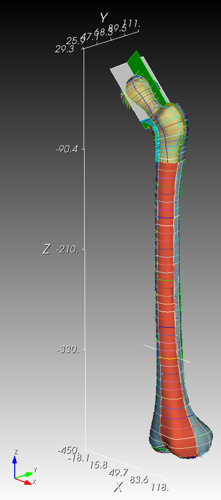

# femurly

The "femurly" repository contains the "femur from Italy" better know as the "Standardized Femur" by Marco Viceconti *et al.* [[Viceconti 2021](#references)].

## Introduction

The "standardized femur" is a 3D surface triangulation of the left human femur.  

## References

* [Machado 2014](doc/Machado_2014_human_proximal_femur_hip_geometry.pdf) human proximal femur hip geometry
* [Viceconti 1996](doc/Viceconti_1996_standardized_femur.pdf) standardized femur
* [Viceconti 1998](doc/Viceconti_1998_comparative_study_automatic_mesh_femur.pdf) comparative study automatic mesh femur
* [Viceconti 2003](doc/Viceconti_2003_muscle_standardized_femur.pdf) muscle standardized femur
* Viceconti 2021
  * Viceconti, Marco.  Personal communication 22 June 2021.  The [Standardized Femur](https://figshare.com/articles/dataset/The_Standardised_Femur_model/3839766) accessed 23 June 2021.  
    * Prof Marco Viceconti - Mobile: +39 349 6307702
    * Professore Ordinario. Dipartimento di Ingegneria Industriale, Alma Mater Studiorum – Università di Bologna. Via Terracini 24, 40131 Bologna (IT). marco.viceconti@unibo.it.
    j:w
    * Direttore, Laboratorio di Tecnologia Medica, IRCCS Istituto Ortopedico Rizzoli. Via di Barbiano 1/10, 40136 Bologna (IT), marco.viceconti@ior.it.
