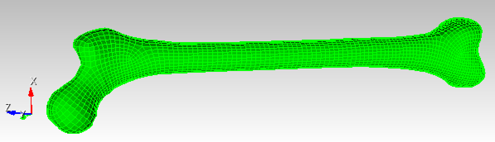
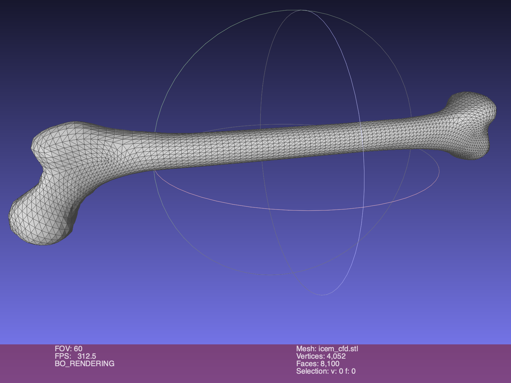

# doc

## 2021-06-03

* Outer surface quad mesh

> Chad, 
> This [[`data/AbaImportAndSmooth.cub` (3.2 MB)](data/AbaImportAndSmooth.cub)] is a cubit file of the femur mesh I was able to generate. But I generated the mesh in Ansys ICEM CFD.
> At a minimum we can use this mesh to generate an stl that is watertight as the starting point for other approaches.
> Adam 

* Cubit STL export to [`data/icem_cfd.stl` (2 MB)](data/icem_cfd.stl)

